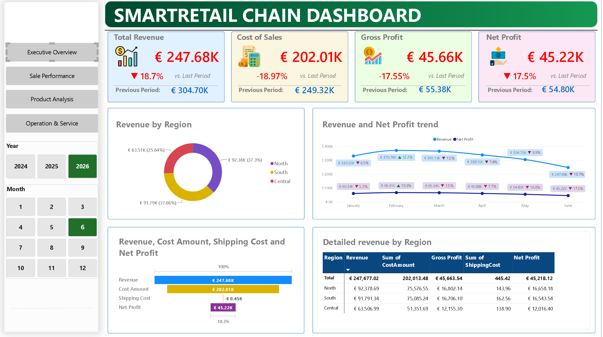
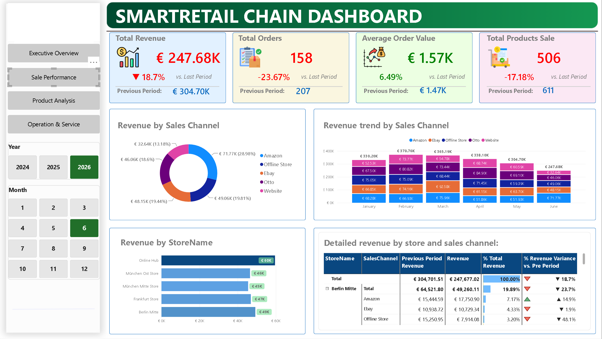
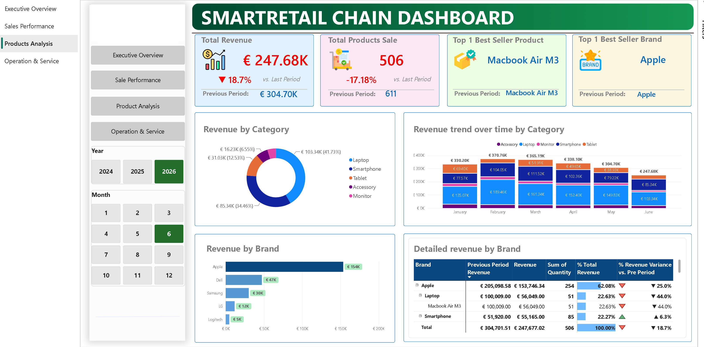
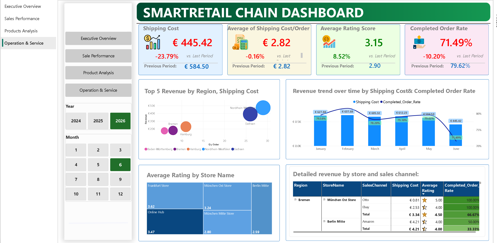

# Smart Retail: E-Commerce Performance Dashboard

## Project Context
Smart Retail is a fictional e-commerce chain. In this project, I designed an interactive Power BI dashboard to analyze sales performance, track key operational metrics, and uncover the root causes of recent revenue fluctuations.
## Data Source
Fictional dataset provided as a course exercise by DUA Edu (Data Upgrade Ability).
All DAX measures, data model, dashboard design and insights below are my own work.
## Tools & Techniques
- **Tool:** Power BI, Power Query, DAX
- **Focus:** Data Visualization, Data Modeling, Business Intelligence, Storytelling
## Data Model & DAX
- Flat file model (Order → Store → Product → Channel), 4 dashboard pages: Executive Overview, Sales Performance, Product Analysis, Operations & Service
- Key DAX measures: Total Revenue, Gross Profit, Net Profit Margin, % Revenue Variance vs. Prior Period, Average Order Value, Completed Order Rate
## Dashboard Preview
| Executive Overview | Sales Performance |
|---|---|
|  |  |
| **Product Analysis** | **Operations & Service** |
|  |  |

## Key Business Insights
_(This is a brief summary. For deeper analysis, please refer to the attached PDF.)_
- **Revenue Trend:** In June 2026, total revenue dropped by 18.7% (marking the 4th consecutive month of decline), yet the net profit margin remained highly stable at 18.3%. This indicates the revenue slump is driven by lower transaction frequency rather than pricing or cost structure issues.
- **Localized Operational Issue:** Identified a severe fulfillment bottleneck at the Berlin Mitte store, where the Amazon order completion rate plummeted to 33.3% alongside a 65.9% drop in website sales, highlighting an operational hotspot rather than a general drop in customer demand.
- **Service & Operations:** Despite an 8.5% improvement in overall customer ratings (reaching 3.15), the completed order rate dropped sharply by 10.2% (down to 71.49%). This points to immediate warehouse and supply chain roadblocks rather than poor customer service.
- **Product Strategy:** The business is heavily over-reliant on a single brand (Apple generates 62.08% of total revenue). A sharp 44.0% decline in the top-selling MacBook Air M3 heavily impacted overall performance, though the smartphone category (iPhone 15) showed a promising 6.3% growth, presenting an opportunity for product diversification.
## Project Assets
- **[Business Insights & Action Plan Report](SmartRetail_Insights.pdf)**: Comprehensive analysis using the "What - So What - Now What" framework.
- **[Power BI Dashboard](SmartRetail_Dashboard.pbix)**: Contains Data Model and DAX Measures
