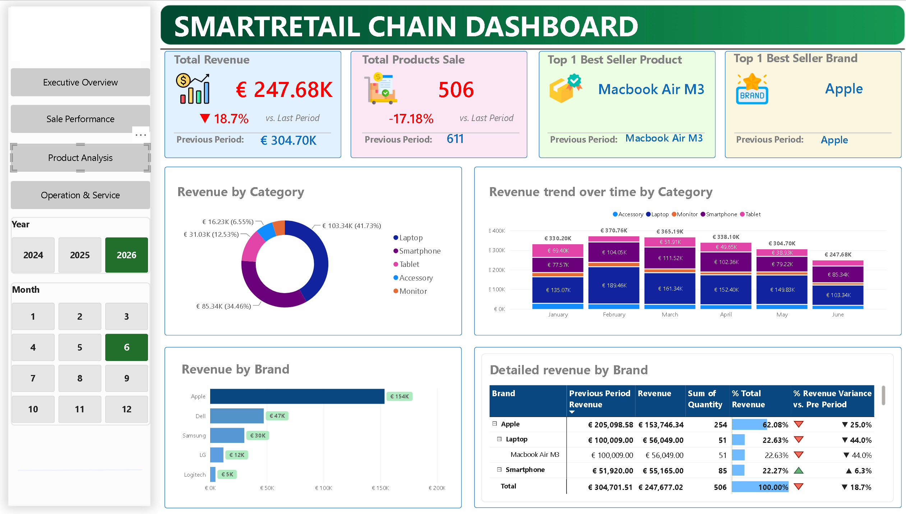
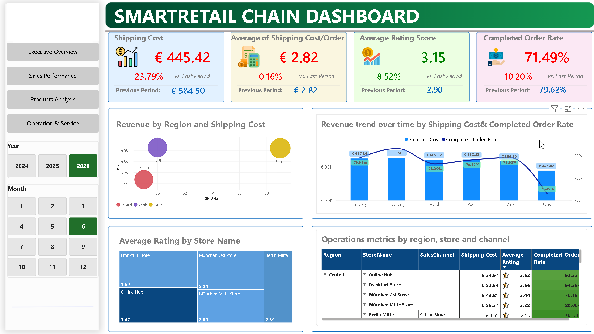

# Smart Retail: E-Commerce Performance Dashboard

## Project Context
Smart Retail is a fictional e-commerce chain. In this project, I designed an interactive Power BI dashboard to analyze sales performance, track key operational metrics, and uncover the root causes of recent revenue fluctuations.
## Data Source
Fictional dataset provided as a course exercise by DUA Edu (Data Upgrade Ability).
All DAX measures, data model, dashboard design and insights below are my own work.
## Tools & Techniques
- **Tool:** Power BI, Power Query, DAX
- **Focus:** Data Visualization, Data Modeling, Business Intelligence, Storytelling
## Data Model & DAX
- Flat file model (Order → Store → Product → Channel), 4 dashboard pages: Executive Overview, Sales Performance, Product Analysis, Operations & Service
- Key DAX measures: Total Revenue, Gross Profit, Net Profit Margin, % Revenue Variance vs. Prior Period, Average Order Value, Completed Order Rate
## Dashboard Preview
| Executive Overview | Sales Performance |
|---|---|
|  |  |
| **Product Analysis** | **Operations & Service** |
|  |  |

## Key Business Insights
*(How to read the numbers: the dashboard is filtered to June 2026 and compares it with May 2026. Because the data ends on 25 June, the dashboard compares 25 days with 31. All percentages below are like-for-like (June 1–25 vs. May 1–25) unless marked otherwise, so they differ from the screenshots, which show the dashboard's full-May comparison.)*

- **Revenue Trend:** The dashboard shows revenue down 18.7% in June. Like-for-like, revenue rose 6.8%, revenue per day is flat (~€9.9K) and net profit margin held at about 18% (18.3% in June). Revenue per day is still about 25% below the February peak (€13.2K; January was €10.7K). Year over year, revenue is also lower: −13.4% for June 1–25 vs. 2025 and −18.7% for May, although June 2025 also dipped below May 2025 (about −9% per day), so part of the June softness may be seasonal.

- **Completion Rate:** The completed order rate fell to 71.5% (from a 78–82% range) while placed orders rose 8.3%, which is worth about €26K of June revenue. The drop is sharpest at Berlin Mitte (−17.2 pts) and Frankfurt (−14.6 pts) and on Website (−17.9 pts) and Otto (−12.6 pts), which points to channel- and process-level issues rather than weak demand. Causes remain hypotheses because the data has no cancellation reason.

- **Regional & Channel Shifts:** Central is the only region with lower revenue (−21.4%) and also has the largest completion-rate drop, while North (+16.2%) and South (+28.4%) grew. Amazon (+85.7%) gained while Website (−22.8%) lost.

- **Product Strategy:** Apple generates 62.08% of revenue. The MacBook Air M3 fell 19.0% at an unchanged price, while smartphones grew 22.5% (iPhone 15 +23.2%), an opportunity to diversify beyond Apple.

## Limitations
- June contains only 25 days of orders. The dashboard's % variance measure compares against the previous full period, so it overstates declines while a month is incomplete. The report uses equal-day ranges instead.
- The like-for-like windows are short, and store × channel figures rest on only 3–11 completed orders per period, so they are signals, not conclusions.
- The dataset has no cancellation reasons, fixed costs, competitor data or stock data, so the causes named in the report are hypotheses to test.
- The data is fictional (course exercise).
## Project Assets
- **[Business Insights & Action Plan Report](SmartRetail_Insights.pdf)**: Comprehensive analysis using the "What - So What - Now What" framework.
- **[Power BI Dashboard](SmartRetail_Dashboard.pbix)**: Contains Data Model and DAX Measures.
